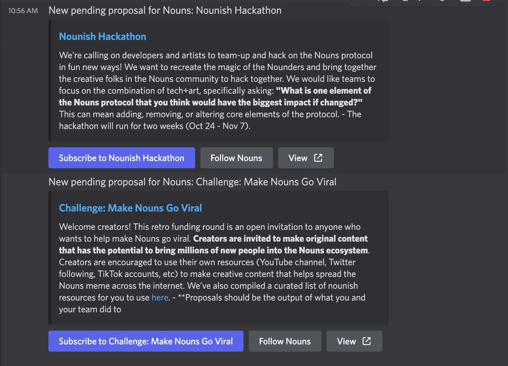
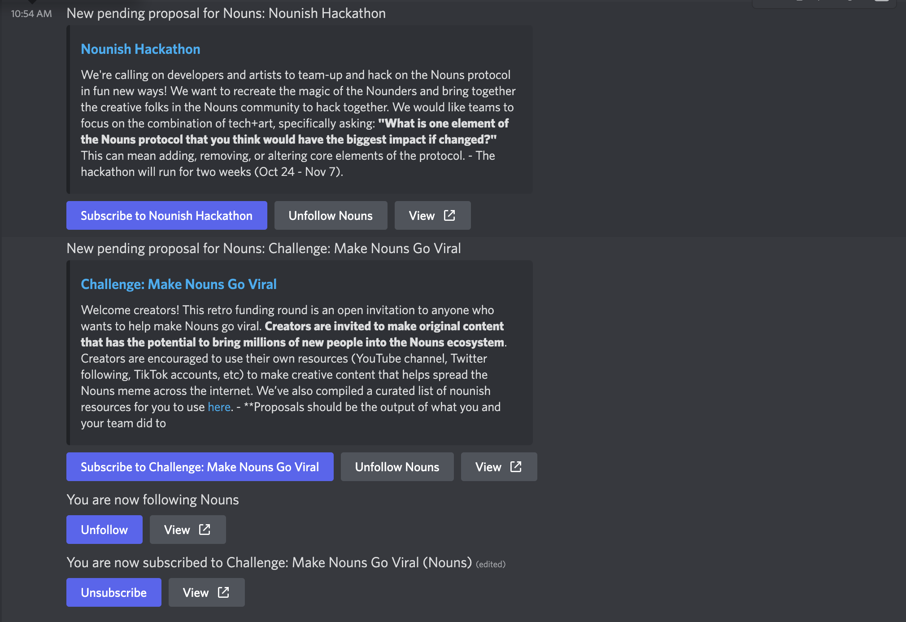

# prop.house discord bot

## Examples:

### Code standards:
1. Written in typescript
2. Uses latest discord-interactions api standards
3. Uses dynamic button / message update UX
4. Uses generated typescript graphql SDK

### Features:
1. Auto-notifies on any status change within a global (configurable) update channel
2. Allows any user to follow a community or to subscribe to a specific prop via DMs
3. Easy user UI for following/interacting as an opt-in behavior via DMs
4. Includes rich embeds of message
5. Good error handling / job queing for maintainance (uses redis)
6. Uses new js SDK for prop.house
7. Uses Bull to manage jobs and prevent rate-limiting from discord.
8. Supports cross-posting to twitter with correct API keys

### Todo:
1. Notify on any updates to the database (time changed etc)
2. Notify winners on their prop submissions

### Getting started:

1. Copy `.env.sample` to `.env` and fill out variables
2. Setup redis URL env variables and system
3. Start app with favorite job runner using `yarn run start`
4. Stay updated :)

# prop.house typescript SDK

### Features:
1. Common queries and typing already exported in ts
2. Used in the the prop.house bot
3. Can be used by any other project
4. Pull requests welcome